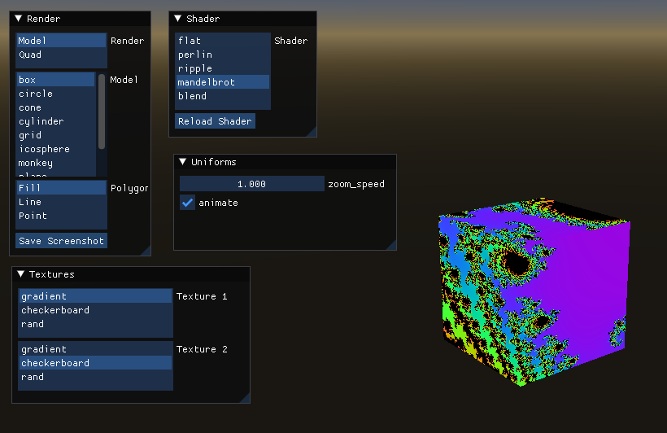

## Overview

Shader Tester is an interactive tool for developing and previewing GLSL shaders
in real time. It is written in C++ and built on top of OpenGL 3.3, GLFW, and
Dear ImGui. The application renders a selectable 3D mesh with a selectable
shader and texture, and exposes a live-reload workflow so you can iterate on
shaders without restarting the program.

Custom uniforms declared in shader source files are automatically detected and
surfaced as controls in the UI, making it easy to expose parameters for
tweaking without writing any UI code. When a shader fails to compile or link,
the error log is displayed in the interface and the previous working program
continues to run.

  

## Features

## Dependencies

## Building

## License

This work is licensed under the GNU General Public License version 3 (GPLv3).

